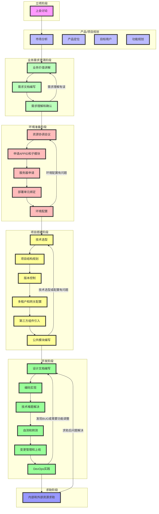

在某为的项目开发中,遵循一套严格而系统的流程管理体系。本文将详细介绍从项目立项到最终交付的完整流程,帮助读者深入理解华为的项目管理方法论。

## 一、立项阶段

立项是项目的起点,这个阶段的决策将直接影响整个项目的走向。

### 1.1 上会讨论

- **可行性评估**
  - 技术可行性：评估现有技术能力是否满足项目需求
  - 资源可行性：人力、设备、资金等资源是否充足
  - 时间可行性：项目时间节点是否合理
  
- **目标制定**
  - 项目总体目标：明确项目的最终目标，确保所有团队成员对项目的愿景有一致的理解。
  - 阶段性目标：将项目分解为多个阶段性目标，以便于逐步实现和评估进展。
  - 具体可衡量的指标：设定具体的、可量化的指标来评估目标的达成情况，例如完成时间、预算控制和质量标准等。
  - 目标调整机制：建立定期评估和调整目标的机制，以应对项目进展中的变化和挑战。
  
- **资源需求分析**
  - 人力资源规划：明确项目所需的各类人力资源，包括开发人员、测试人员、项目经理等，并制定相应的招聘和培训计划。
  - 设备资源清单：列出项目实施所需的所有设备和工具，包括硬件、软件及其他相关资源，确保资源的可用性和适配性。
  - 预算规划：制定详细的预算计划，涵盖人力成本、设备采购、运营费用等，确保项目在预算范围内顺利进行。
- **时间规划**
  - 项目里程碑设定：明确项目的主要阶段和关键成果，确保团队对项目进展有清晰的认识。
  - 关键时间节点确定：识别项目中重要的时间节点，以便于监控进度和调整计划。
  - 各阶段工期估算：对每个阶段的工作量进行合理估算，确保项目按时交付。
  
- **实施策略制定**
  - 开发模式选择（如敏捷、瀑布等）：根据项目特点和团队能力选择合适的开发模式，以提高开发效率和适应性。
  - 团队组织架构设计：明确团队成员的角色与职责，确保各个职能之间的协作顺畅，提升团队整体工作效率。
  - 风险应对策略：识别潜在风险，制定相应的应对措施和预案，以降低风险对项目进展的影响，确保项目顺利进行。

## 二、产品/项目规划

### 2.1 市场分析

- 市场现状调研：分析当前市场的规模、增长率和主要参与者，以了解市场的整体状况。
- 竞品分析：研究竞争对手的产品、市场策略和用户反馈，识别自身产品的优势和劣势。
- 市场趋势预测：基于市场数据和行业动态，预测未来市场的发展方向和潜在机会。
- SWOT分析：评估产品的优势、劣势、机会和威胁，为战略决策提供依据。

### 2.2 产品定位

- 产品价值主张：明确产品为用户提供的独特价值，帮助用户解决哪些具体问题或满足哪些需求。
- 核心竞争力分析：评估产品在市场中的竞争优势，包括技术、品牌、服务等方面的独特性。
- 差异化策略：制定与竞争对手不同的市场策略，以突出产品的独特性和吸引目标用户。
- 产品生命周期规划：分析产品从引入、成长、成熟到衰退的各个阶段，制定相应的市场策略和资源配置。

### 2.3 目标用户

- 用户画像描述：详细描述目标用户的基本信息、行为习惯、兴趣爱好等，以便更好地理解用户需求。
- 用户需求分析：通过调研和访谈，深入挖掘用户的真实需求，确保产品设计能够满足用户期望。
- 用户使用场景：分析用户在不同环境和情况下使用产品的情境，帮助团队设计更符合实际使用的功能。
- 用户痛点识别：识别用户在使用现有产品或服务时遇到的问题，明确需要解决的关键痛点，以提升用户体验。

### 2.4 功能规划

- **核心功能清单**：列出产品的所有核心功能，确保每个功能都能满足用户的基本需求和项目目标。
- **功能优先级排序**：根据用户需求、市场反馈和技术可行性对功能进行优先级排序，以便在开发过程中集中资源于最重要的功能。
- **MVP(最小可行产品)定义**：明确最小可行产品的范围，确保在最短的时间内推出具备核心功能的产品，以便快速获取用户反馈并进行迭代。
- **迭代规划**：制定产品迭代的计划，包括每个迭代周期的目标、功能实现和用户反馈收集，以持续优化产品并提升用户体验。

## 三、业务需求澄清阶段

### 3.1 业务价值讲解

- **商业价值阐述**
  - **收入预期**：分析项目实施后预期的收入增长，包括直接销售收入和潜在的市场份额提升。
  - **成本收益分析**：评估项目的总成本与预期收益之间的关系，确保投资的合理性和可行性。
  - **市场竞争力提升**：探讨项目如何增强公司在市场中的竞争地位，包括品牌影响力和客户忠诚度的提升。
  - **用户价值体现**：明确项目为用户带来的具体价值，包括解决用户痛点和提升用户体验的方式。
  
- **预期收益分析**
  - 直接经济效益：评估项目实施后直接带来的收入增长，包括销售额的提升和成本的降低。
  - 间接效益评估：分析项目对品牌形象、客户满意度和市场份额等方面的积极影响，确保全面理解项目的价值。
  - 长期战略价值：探讨项目如何支持公司的长期目标和愿景，包括技术创新、市场拓展和竞争优势的持续提升。

### 3.2 需求文档编写

- 业务需求说明书(BRD)：详细描述项目的业务目标、范围和预期成果，确保所有利益相关者对项目的理解一致。
- 功能需求说明书(FRD)：列出产品的具体功能需求，包括每个功能的详细描述、用户交互和系统行为，以指导开发团队的实现。
- 用户故事(User Story)：以用户的视角描述需求，强调用户的需求和期望，帮助团队更好地理解用户的使用场景和目标。
- 验收标准定义：明确每个功能或需求的验收标准，确保在开发完成后能够有效地验证功能是否符合预期，保证产品质量。

### 3.3 需求理解和确认

- 需求评审会议：定期召开会议，确保所有相关利益方对需求的理解一致，及时识别和解决潜在问题。
- 跨团队沟通对齐：建立有效的沟通渠道，促进不同团队之间的信息共享和协作，确保需求的顺利实施。
- 需求确认书签署：在需求明确后，所有相关方需签署确认书，以确保对需求的认可和承诺，避免后续的误解。
- 需求变更控制：建立变更管理流程，确保任何需求变更都经过评估和批准，以维护项目的稳定性和可控性。

### 3.4 反馈循环

- 需求理解验证：确保团队对需求的理解准确无误，通过讨论和反馈机制进行验证。
- 疑点澄清机制：建立一个有效的渠道，及时解答团队成员在需求理解过程中遇到的疑问，确保信息透明。
- 需求调整流程：制定明确的流程，以便在需求变化时能够迅速响应并调整相关计划，确保项目的灵活性。
- 变更影响评估：在需求变更时，评估其对项目进度、资源和成本的影响，以便做出合理的决策和调整。

## 四、环境准备阶段

### 4.1 资源协调会议

- 组织架构确定：明确项目团队的组织结构，包括各个角色的职责和汇报关系，以确保项目的顺利推进。
- 人员分工安排：根据项目需求和团队成员的专业技能，合理分配任务，确保每个成员都能发挥其最大潜力。
- 资源分配方案：制定详细的资源分配计划，包括人力、物力和财力的合理配置，以支持项目的各项活动。
- 跨部门协作机制：建立有效的跨部门沟通和协作机制，促进信息共享和资源整合，以提高项目的整体效率和效果。

### 4.2 系统准备

- **APPID申请流程**：明确申请APPID的步骤和所需材料，确保申请过程高效且符合相关规定。
- **子模块划分**：根据系统功能和业务需求，将系统划分为多个子模块，以便于管理和开发。
- **权限管理体系**：建立完善的权限管理体系，确保不同角色的用户能够访问相应的系统功能和数据，保障系统安全。
- **系统架构设计**：设计系统的整体架构，包括前端、后端和数据库的交互方式，确保系统的可扩展性和高可用性。

### 4.3 基础设施

- **服务器资源申请**：明确申请服务器资源的流程，包括所需的硬件配置、数量和申请时间，以确保项目的基础设施能够满足需求。
- **网络环境配置**：详细描述网络环境的设置，包括IP地址分配、网络拓扑结构和安全策略，以确保系统的稳定性和安全性。
- **存储资源分配**：评估项目对存储资源的需求，制定合理的存储方案，包括数据备份和恢复策略，以保障数据的安全性和可用性。
- **安全防护措施**：建立全面的安全防护措施，包括防火墙设置、入侵检测系统和数据加密方案，以保护系统和数据免受潜在威胁。

### 4.4 环境搭建

- 开发环境配置：确保开发环境的设置符合项目需求，包括所需的软件、工具和库的安装与配置，以支持开发团队的工作。
- 测试环境部署：搭建与生产环境相似的测试环境，以便进行功能测试和性能测试，确保系统在上线前的稳定性和可靠性。
- 预生产环境准备：在生产环境之前，设置预生产环境进行最终测试，确保所有功能正常运行，并进行用户验收测试。
- 生产环境规划：制定详细的生产环境部署计划，包括硬件配置、网络设置和安全措施，以确保系统的高可用性和安全性。

### 4.5 反馈处理

- 环境问题跟踪：定期检查和记录环境中出现的问题，确保及时发现并解决潜在的环境故障。
- 配置优化调整：根据测试反馈和性能监控数据，持续优化系统配置，以提高系统的运行效率和稳定性。
- 性能测试验证：进行系统性能测试，验证系统在不同负载下的表现，确保满足性能要求。
- 环境文档维护：定期更新和维护环境相关文档，确保文档的准确性和可用性，以便于团队成员参考和使用。

## 五、项目搭建阶段

### 5.1 技术架构

- 技术栈选型：根据项目需求和团队技能，选择合适的技术栈，以确保开发效率和系统性能。
- 框架评估选择：对不同的开发框架进行评估，考虑其社区支持、文档质量和学习曲线，选择最适合项目的框架。
- 数据库方案：根据数据存储需求和访问模式，选择合适的数据库类型（如关系型或非关系型），并设计数据库架构。
- 中间件规划：确定所需的中间件组件，如消息队列、缓存系统等，以支持系统的高可用性和可扩展性。

### 5.2 项目结构

- 代码结构设计：明确项目的代码组织方式，包括文件夹结构、命名规范和代码风格，以提高代码的可读性和可维护性。
- 模块划分方案：根据功能需求和系统架构，将项目划分为多个模块，确保每个模块的职责清晰，便于团队协作和独立开发。
- 接口规范制定：制定统一的接口规范，包括接口的输入输出格式、错误处理机制和版本管理，以确保系统各部分之间的顺畅交互。
- 开发规范确立：建立项目的开发规范，包括代码提交规范、文档编写要求和代码审查流程，以提升团队的开发效率和代码质量。

### 5.3 基础设施搭建

- **版本控制系统**：用于管理代码的版本变更，确保团队成员能够协同工作，追踪代码历史，方便回滚和分支管理。
- **持续集成环境**：自动化构建和测试代码的环境，确保每次代码提交后都能快速验证代码的正确性，减少集成问题。
- **自动化部署**：通过脚本和工具实现代码的自动化部署，减少人工操作，提高部署效率和准确性，确保系统的快速上线。
- **监控系统**：实时监控系统的运行状态和性能指标，及时发现和处理潜在问题，保障系统的稳定性和可用性。

### 5.4 系统集成

- **多租户实现**：设计和实现多租户架构，以支持多个客户在同一系统中独立运行，确保数据隔离和安全性。
- **网关服务配置**：配置和管理网关服务，负责请求路由、负载均衡和安全认证，提升系统的可扩展性和安全性。
- **第三方系统对接**：与外部系统进行集成，确保数据的顺畅流动和功能的互操作性，提升系统的整体功能。
- **公共组件开发**：开发可复用的公共组件，提供基础功能支持，减少重复开发，提高开发效率和代码质量。

## 六、开发阶段

### 6.1 设计工作

- **概要设计**：在项目初期阶段，进行系统的整体架构设计，明确系统的功能模块、数据流和交互方式，为后续的详细设计奠定基础。
- **详细设计**：对每个功能模块进行深入分析，制定详细的设计文档，包括类图、时序图和状态图，确保设计的可实现性和可维护性。
- **数据库设计**：根据系统需求，设计数据库的结构，包括表的设计、字段定义和索引优化，确保数据的完整性和查询效率。
- **接口设计**：制定系统各模块之间的接口规范，明确接口的输入输出参数、数据格式和错误处理机制，以保证模块间的高效协作。
- **安全方案设计**：评估系统的安全需求，制定相应的安全策略，包括身份验证、权限管理和数据加密方案，以保护系统和用户数据的安全性。

### 6.2 开发实现

- 功能模块开发：根据设计文档进行各个功能模块的编码实现，确保代码符合设计要求和规范。
- 代码审查：团队成员之间相互审查代码，确保代码质量，发现潜在问题并进行改进。
- 单元测试：为每个功能模块编写单元测试，验证模块的功能是否正常，确保代码的可靠性。
- 集成测试：将各个功能模块进行集成，测试模块之间的交互和整体系统的功能，确保系统的稳定性和性能。

### 6.3 质量保证

- **代码质量控制**：通过代码审查、静态代码分析和编码规范检查等手段，确保代码符合质量标准，减少潜在缺陷，提高代码的可维护性和可读性。
- **测试用例编写**：根据需求文档和设计文档，编写全面的测试用例，覆盖功能、边界和异常情况，确保系统在各种情况下的正确性和稳定性。
- **自动化测试**：利用自动化测试工具和框架，实施持续集成中的自动化测试，快速反馈代码变更对系统的影响，提高测试效率和准确性。
- **性能优化**：通过性能测试和分析工具，识别系统瓶颈，优化代码和数据库查询，提升系统的响应速度和处理能力，确保系统在高负载下的稳定性。

### 6.4 部署上线

- **变更申请**：在进行系统变更时，团队成员需提交变更申请，详细说明变更的目的、影响范围及实施计划，以确保所有相关人员知晓并评估变更的风险。
- **灰度发布**：采用灰度发布策略，将新版本逐步推送给部分用户，监控其表现和反馈，确保新功能的稳定性和兼容性，降低对全体用户的影响。
- **监控告警**：建立全面的监控系统，实时跟踪系统性能和关键指标，设置告警机制，及时通知相关人员处理潜在问题，保障系统的高可用性。
- **应急预案**：制定详细的应急预案，明确在系统故障或异常情况下的处理流程和责任分工，确保团队能够迅速响应，最小化业务影响和数据损失。

## 七、求助与支持

### 7.1 内部支持

- **团队内部研讨**：定期组织团队成员进行技术和项目相关的讨论，分享各自的见解和经验，以促进知识的传播和团队的协作。
- **技术专家咨询**：邀请领域内的技术专家进行指导，帮助团队解决复杂的技术问题，提升整体技术水平和项目质量。
- **架构师指导**：架构师负责对系统架构进行评审和优化，确保设计方案的合理性和可扩展性，为团队提供专业的技术支持。
- **经验分享会**：定期举办经验分享会，鼓励团队成员分享在项目实施过程中的成功案例和教训，以便其他成员借鉴和学习。

### 7.2 外部资源

- **平台组支持**：提供技术支持和资源协调，确保项目在平台层面的顺利进行。
- **供应商咨询**：与供应商进行沟通，获取专业建议和解决方案，以应对特定技术挑战。
- **社区交流**：参与技术社区的讨论和活动，分享经验和获取行业最新动态，促进知识的共享与传播。
- **专业培训**：组织和参加相关领域的培训课程，提升团队成员的专业技能和技术水平，以适应项目需求的变化。

### 7.3 问题解决

- **问题分类管理**：对项目中出现的问题进行系统化分类，便于团队快速定位和处理，确保问题得到及时解决。
- **解决方案评估**：对不同的解决方案进行全面评估，包括可行性、成本、时间和风险等因素，以选择最佳的解决方案。
- **知识库建设**：建立和维护项目知识库，记录问题解决过程、经验教训和最佳实践，促进团队成员之间的知识共享和积累。
- **经验总结沉淀**：定期对项目实施过程中的经验进行总结和反思，提炼出可供未来项目参考的经验教训，提升团队的整体能力和项目管理水平。

通过以上详细的流程体系，某为确保项目开发的规范性、可控性和高质量交付。每个阶段都有明确的输入输出，通过反馈循环机制不断优化和改进，最终达到预期的项目目标。这套流程体系不仅体现了某为对项目管理的专业性，也展示了其追求卓越的企业文化。
