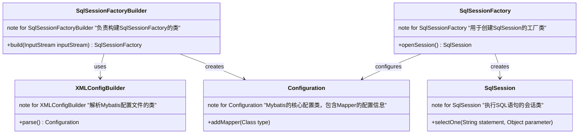
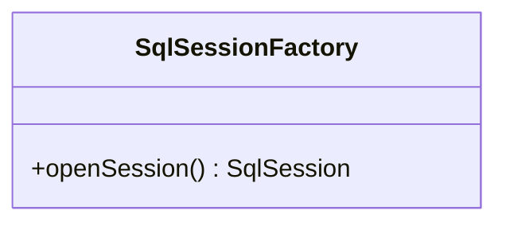
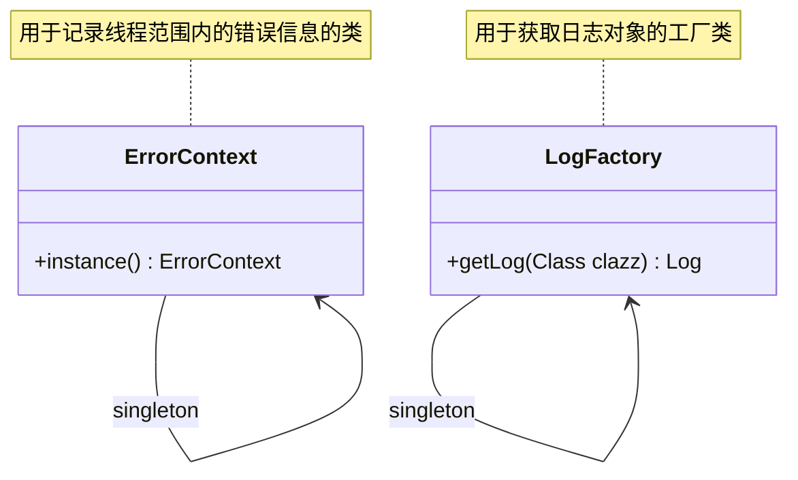
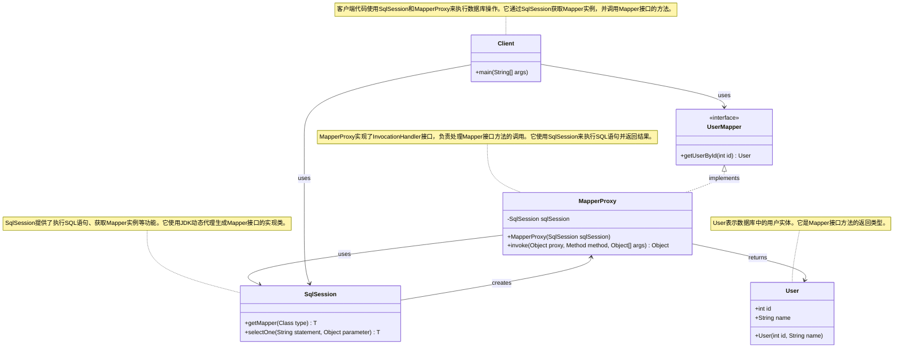
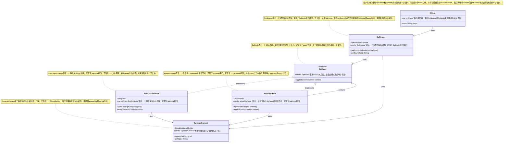
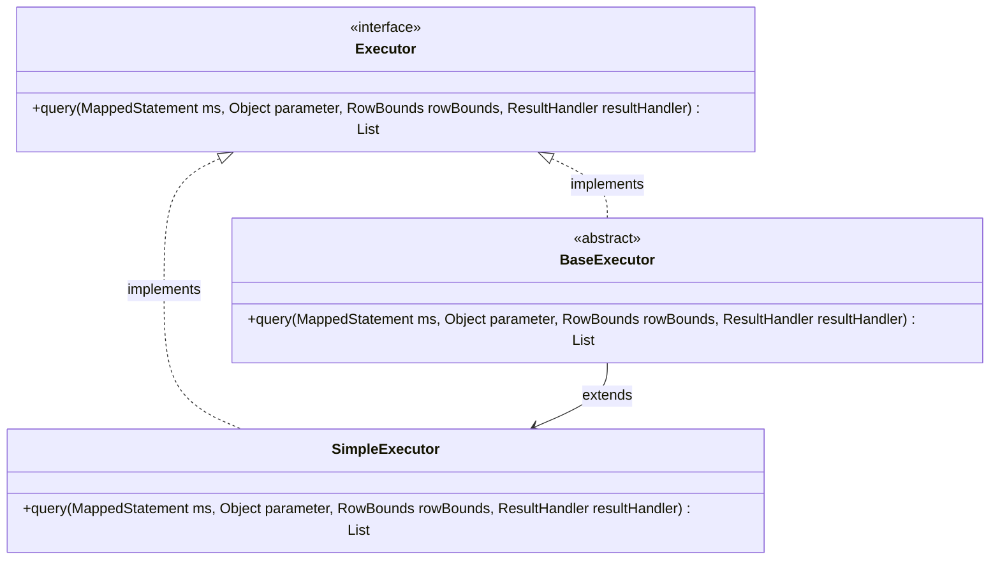
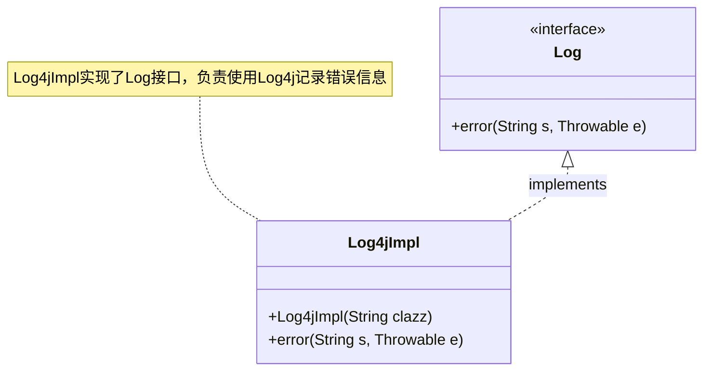
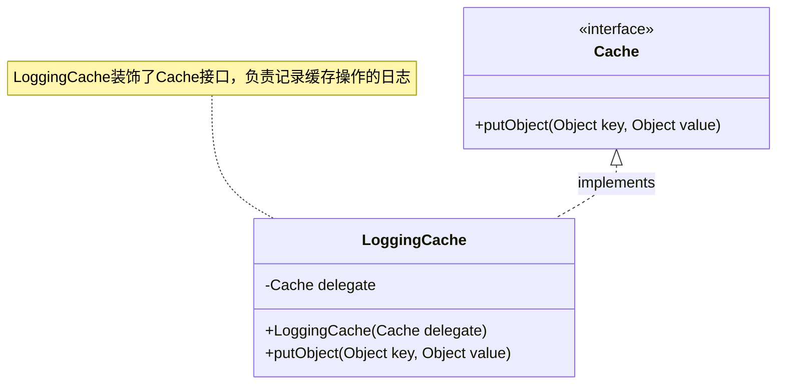
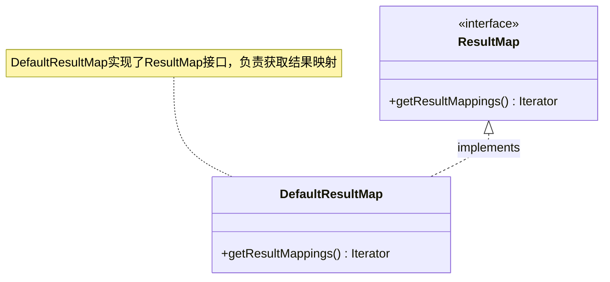

# 引言

在学习设计模式的过程中，我们往往只停留在理论层面，很少有机会在实际开发中应用这些模式。然而，理解设计模式的最佳途径之一是通过阅读优秀框架的源码，如Mybatis。Mybatis作为一个广泛使用的持久层框架，其实现中运用了多种设计模式，包括Builder模式、工厂模式、单例模式、代理模式、组合模式、模板方法模式、适配器模式、装饰者模式和迭代器模式。本文将探讨这些设计模式在Mybatis中的具体应用，帮助大家更好地理解和应用这些设计模式。

# 正文

## 1. Builder模式

### 定义

Builder模式将一个复杂对象的构建与其表示分离，使得同样的构建过程可以创建不同的表示。



### 在Mybatis中的应用

`Mybatis`中的`SqlSessionFactoryBuilder`使用了Builder模式。该类通过调用`XMLConfigBuilder`读取Mybatis配置文件和Mapper文件，构建核心对象`Configuration`，然后使用该对象创建`SqlSessionFactory`。

### 代码示例

```java
SqlSessionFactoryBuilder builder = new SqlSessionFactoryBuilder();
SqlSessionFactory factory = builder.build(inputStream);
```

## 2. 工厂模式

### 定义

工厂模式提供了一种创建对象的方式，而不需要指定具体的类。它通过定义一个接口来创建对象，允许子类决定实例化哪一个类。



### 在Mybatis中的应用

在`Mybatis`中，`SqlSessionFactory`实现了简单工厂模式。根据不同的参数，工厂可以返回不同类型的`SqlSession`实例。具体来说，`SqlSessionFactory`根据配置文件中的信息，决定创建哪种类型的`SqlSession`，从而实现灵活的会话管理。

### 代码示例

```java
SqlSessionFactory factory = new SqlSessionFactoryBuilder().build(inputStream);
SqlSession session = factory.openSession();

```

## 3. 单例模式

定义：单例模式确保一个类只有一个实例，并提供一个全局访问点。



### 在Mybatis中的应用

`Mybatis`中的`ErrorContext`和`LogFactory`使用了单例模式。`ErrorContext`用于记录线程范围内的错误信息，而`LogFactory`用于获取日志对象。

### 代码示例

```java

ErrorContext context = ErrorContext.instance();
context.message("test");  

```

## 4. 代理模式

### 定义

代理模式为其他对象提供一个代理以控制对这个对象的访问。



### 在Mybatis中的应用

`Mybatis`的核心功能之一是通过代理模式实现的。开发者只需定义`Mapper`接口，`Mybatis`会自动生成代理类来执行SQL语句。

### 代码示例

```java
class UserMapper {
    List<User> selectAll();
}
UserMapper mapper = session.getMapper(UserMapper.class);
mapper.selectAll();

// 生成代理类
class UserMapperProxy implements MapperProxy<UserMapper> {
    @Override
    public List<User> selectAll() {
        return sqlSession.selectList("select * from users");
    }
} 
```

## 5. 组合模式

定义：组合模式将对象组合成树形结构以表示“部分-整体”的层次结构。

### 在Mybatis中的应用

`Mybatis`中的`SqlNode`和`SqlSource`使用了组合模式，构建复杂的SQL语句结构。



## 6. 模板方法模式

定义：模板方法模式定义了一个算法的骨架，并允许子类为一个或多个步骤提供实现。



### 在Mybatis中的应用

`Mybatis`中的`BaseExecutor`和`SimpleExecutor`使用了模板方法模式，定义了执行SQL的通用流程。

### 代码示例

```java
public abstract class BaseExecutor implements Executor {
    public <E> List<E> query(MappedStatement ms, Object parameter, RowBounds rowBounds, ResultHandler resultHandler) throws SQLException {
        // 模板方法
    }
}
```

## 7. 适配器模式

### 定义

适配器模式将一个类的接口转换成客户端期望的另一个接口。



### 在Mybatis中的应用

`Mybatis`中的`Log`接口使用了适配器模式，适配不同的日志框架。

### 代码示例

```java
public class Log4jImpl implements Log {
    private Logger log;
    public Log4jImpl(String clazz) {
        log = Logger.getLogger(clazz);
    }
    // 实现Log接口的方法
}
```

## 8. 装饰者模式

### 定义

装饰者模式动态地给一个对象添加一些额外的职责。



### 在Mybatis中的应用

`Mybatis`中的`Cache`接口使用了装饰者模式，通过不同的装饰器实现缓存功能。

### 代码示例

```java
public class LoggingCache implements Cache {
    private Cache delegate;
    public LoggingCache(Cache delegate) {
        this.delegate = delegate;
    }
    // 实现Cache接口的方法
}
```

## 9. 迭代器模式

### 定义

迭代器模式提供一种方法顺序访问一个聚合对象中的各个元素，而又不暴露其内部表示。



### 在Mybatis中的应用

`Mybatis`中的`ResultMap`使用了迭代器模式，遍历结果集中的每一行数据。

### 代码示例

```java
public class DefaultResultMap implements ResultMap {
    public Iterator<ResultMapping> getResultMappings() {
        return mappings.iterator();
    }
}
```

# 结论

通过深入分析`Mybatis`中各种设计模式的应用，我们可以看到设计模式在实际开发中的重要性。设计模式不仅仅是理论，它们是解决实际问题的有效工具。通过阅读和理解优秀框架的源码，我们可以更好地掌握这些设计模式，并在自己的项目中灵活应用。希望本文能帮助读者在设计模式的学习和应用上更进一步。
