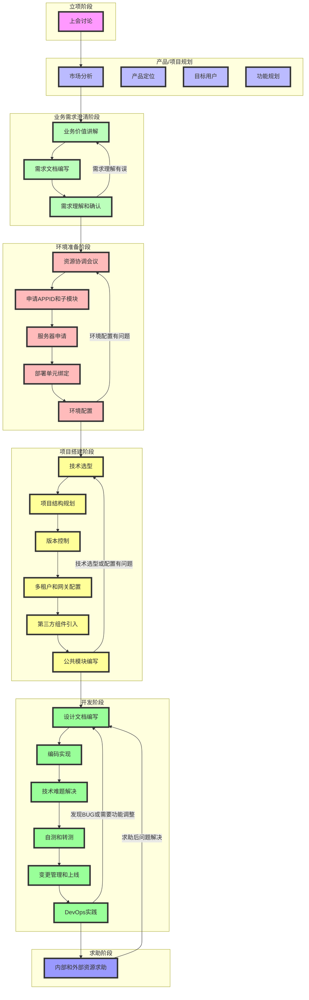

# 华为项目开发流程详解

在华为的项目开发中,遵循一套严格而系统的流程管理体系。本文将详细介绍从项目立项到最终交付的完整流程,帮助读者深入理解华为的项目管理方法论。

## 一、立项阶段

立项是项目的起点,这个阶段的决策将直接影响整个项目的走向。

### 1.1 上会讨论

- **可行性评估**
  - 技术可行性：评估现有技术能力是否满足项目需求
  - 资源可行性：人力、设备、资金等资源是否充足
  - 时间可行性：项目时间节点是否合理
  
- **目标制定**
  - 项目总体目标
  - 阶段性目标
  - 具体可衡量的指标
  
- **资源需求分析**
  - 人力资源规划
  - 设备资源清单
  - 预算规划
  
- **时间规划**
  - 项目里程碑设定
  - 关键时间节点确定
  - 各阶段工期估算
  
- **实施策略制定**
  - 开发模式选择(敏捷/瀑布等)
  - 团队组织架构设计
  - 风险应对策略

## 二、产品/项目规划

### 2.1 市场分析

- 市场现状调研
- 竞品分析
- 市场趋势预测
- SWOT分析

### 2.2 产品定位

- 产品价值主张
- 核心竞争力分析
- 差异化策略
- 产品生命周期规划

### 2.3 目标用户

- 用户画像描述
- 用户需求分析
- 用户使用场景
- 用户痛点识别

### 2.4 功能规划

- 核心功能清单
- 功能优先级排序
- MVP(最小可行产品)定义
- 迭代规划

## 三、业务需求澄清阶段

### 3.1 业务价值讲解

- **商业价值阐述**
  - 收入预期
  - 成本收益分析
  - 市场竞争力提升
  - 用户价值体现
  
- **预期收益分析**
  - 直接经济效益
  - 间接效益评估
  - 长期战略价值

### 3.2 需求文档编写

- 业务需求说明书(BRD)
- 功能需求说明书(FRD)
- 用户故事(User Story)
- 验收标准定义

### 3.3 需求理解和确认

- 需求评审会议
- 跨团队沟通对齐
- 需求确认书签署
- 需求变更控制

### 3.4 反馈循环

- 需求理解验证
- 疑点澄清机制
- 需求调整流程
- 变更影响评估

## 四、环境准备阶段

### 4.1 资源协调会议

- 组织架构确定
- 人员分工安排
- 资源分配方案
- 跨部门协作机制

### 4.2 系统准备

- APPID申请流程
- 子模块划分
- 权限管理体系
- 系统架构设计

### 4.3 基础设施

- 服务器资源申请
- 网络环境配置
- 存储资源分配
- 安全防护措施

### 4.4 环境搭建

- 开发环境配置
- 测试环境部署
- 预生产环境准备
- 生产环境规划

### 4.5 反馈处理

- 环境问题跟踪
- 配置优化调整
- 性能测试验证
- 环境文档维护

## 五、项目搭建阶段

### 5.1 技术架构

- 技术栈选型
- 框架评估选择
- 数据库方案
- 中间件规划

### 5.2 项目结构

- 代码结构设计
- 模块划分方案
- 接口规范制定
- 开发规范确立

### 5.3 基础设施搭建

- 版本控制系统
- 持续集成环境
- 自动化部署
- 监控系统

### 5.4 系统集成

- 多租户实现
- 网关服务配置
- 第三方系统对接
- 公共组件开发

## 六、开发阶段

### 6.1 设计工作

- 概要设计
- 详细设计
- 数据库设计
- 接口设计
- 安全方案设计

### 6.2 开发实现

- 功能模块开发
- 代码审查
- 单元测试
- 集成测试

### 6.3 质量保证

- 代码质量控制
- 测试用例编写
- 自动化测试
- 性能优化

### 6.4 部署上线

- 变更申请
- 灰度发布
- 监控告警
- 应急预案

## 七、求助与支持

### 7.1 内部支持

- 团队内部研讨
- 技术专家咨询
- 架构师指导
- 经验分享会

### 7.2 外部资源

- 平台组支持
- 供应商咨询
- 社区交流
- 专业培训

### 7.3 问题解决

- 问题分类管理
- 解决方案评估
- 知识库建设
- 经验总结沉淀

通过以上详细的流程体系，华为确保项目开发的规范性、可控性和高质量交付。每个阶段都有明确的输入输出，通过反馈循环机制不断优化和改进，最终达到预期的项目目标。这套流程体系不仅体现了华为对项目管理的专业性，也展示了其追求卓越的企业文化。
